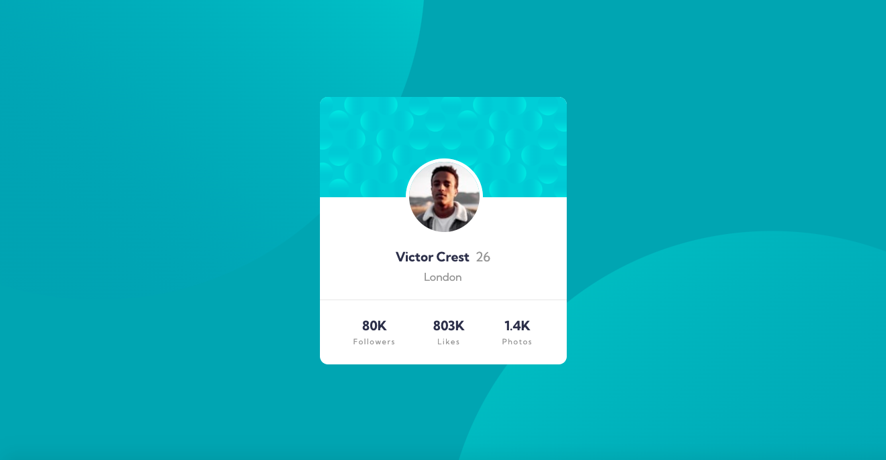
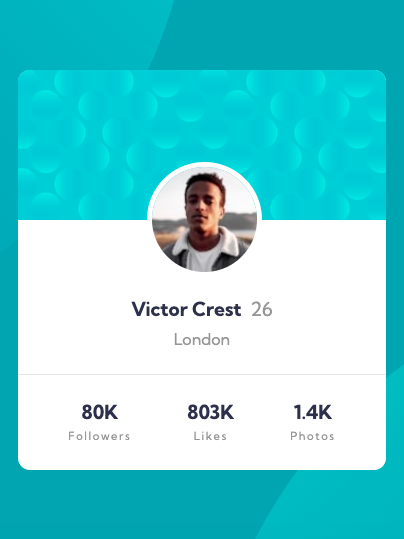

## Table of contents

- [Overview](#overview)
  - [Screenshot](#screenshot)
- [My process](#my-process)
  - [Built with](#built-with)
  - [What I learned](#what-i-learned)
  - [Continued development](#continued-development)
- [Author](#author)

## Overview

### The challenge

### Screenshot

### Links

- Solution URL: Soon to come
- Live Site URL: Soon to come

## My process

### Built with

- Semantic HTML5 markup
- CSS custom properties
- Flexbox
- CSS Grid

### What I learned

Using Sass (but not sure it was very helpful for this project)

### Continued development

More complex projects with Sass.

## Author

Me ;-)

